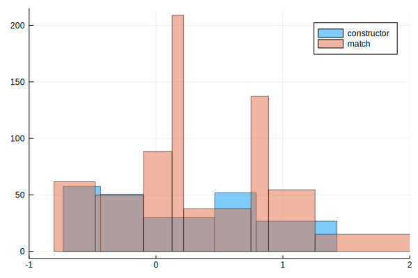

# Compliance with the PCRE test set
!!! note 
    PCRE features supported by `@re_str` 
    - ✅ sequences, alternations (`|`), repetitions (`*`,`+`,`{n}`, `{min,}`, `{min,max}`), optional matches (`?`)
    - ✅ escaped characters and generic character types
    - ✅ character ranges (`[]`)
    - ✅ non-capturing groups
    - ✅ capturing groups, backreferences, subroutines (all by index, relative index and name)
    - ✅ simple assertions (`\A`, `\z`, `\Z`, `\b`, `\B`, `^`, `$`)
    - ✅ lookaheads and lookbehinds
    - ✅ atomic groups
    - ✅ lazy repetitions
    - ✅ conditional expressions
    - ✅ internal and pattern options setting
    - ✅ comments
!!! warning 
    PCRE functionality that is currently not supported:
    - ❌ Capture groups in lookbehinds.
    - ❌ Lookaheads within lookbehinds.
    - ❌ ACCEPT, SKIP, COMMIT, THEN, PRUNE, \K
```@setup session
using CombinedParsers
using CombinedParsers.Regexp
```
CombinedParsers.jl is tested and benchmarked against the PCRE C library testset.
The PCRE test output is downloaded from 
[the PCRE source repository](https://github.com/rurban/pcre/blob/master/testdata/testoutput1), 
parsed with 
[a `CombinedParser`](https://github.com/gkappler/CombinedParsers.jl/blob/master/test/pcretest-parser.jl), to run tests benchmarks on `Base.Regex` and `CombinedParsers.Regexp.Regcomb`.
(Note: tests are relaxed for some cases allowing empty captures (`""`) for unset captures (`nothing`).
## Test Overview
3080 successful tests on 978 patterns
(See [list of compliant patterns](pcre-compliance-succeeded.md)).

18 failed tests on 10 patterns
(See [list of failed patterns](pcre-compliance-failed.md)).
### Performance Overview:
The PCRE C backend of `@r_str` has arrived at a widely optimized codebase after decades of improvements.
C PCRE2 optimized is among the fastest regex libraries ([second behind Rust](https://github.com/mariomka/regex-benchmark/tree/optimized), running [mariomka](https://github.com/mariomka)'s benchmark will position CombinedParser among its competition).

Although CombinedParsers.jl is a very young package that will be optimized further, 
`@re_str` pure Julia Regcomb is often competitive with PCRE `@r_str` Regex.


PCRE benchmarks have a range between 86.0ns to 521.0ns.
CombinedParsers benchmarks range between 34.0ns to 19704.0ns.
59.0% of benchmarks are faster with CombinedParsers compared to PCRE.
The average ratio of `time_Recomb/time_Regex` is 1.26.


These benchmarkin results are for the first 100 test patterns in the PCRE test set, comparing `match(Regex(pattern,flags),s)` with `_iterate(Regcomb(pattern,flags),s)`.


Benchmark timings for regular expression construction and matching comparing `Regex` (x axis) and `Regcomb` (y axis), both on a log10 scale.
Points represent an individual benchmark for a pattern construction or match.
Cases with `CombinedParsers` being faster than the C library PCRE are paint green, slower cases are red.
### Benchmark ratios histogram:



The histograms of ratios of `time_Regcomb/time_Regex` on a log scale demonstrate that `CombinedParser` implementation is competitive.
Worst cases are investigated for further optimization [in this IJulia notebook](https://github.com/gkappler/CombinedParsers.jl/blob/master/benchmark/benchmarks.ipynb).

Next steps in optimization are
- caching codeunit lengths of matches for backtracking.
- memoization of sub-parsings.
## Unsupported
252 unsupported patterns were omitted for the following reasons:

- `ACCEPT` excluded 16 patterns.
- `COMMIT` excluded 35 patterns.
- `PRUNE` excluded 18 patterns.
- `SKIP` excluded 29 patterns.
- `THEN` excluded 50 patterns.
- `\K` excluded 13 patterns.
- `checking for pattern recursion` excluded 6 patterns.
- `options aftertext` excluded 12 patterns.
- `options g` excluded 5 patterns.
- `options g,aftertext` excluded 7 patterns.
- `options g,dupnames` excluded 5 patterns.
- `options gm` excluded 2 patterns.
- `options imsx,mark` excluded 2 patterns.
- `options mark` excluded 38 patterns.
- `options mark,no_start_optimize` excluded 1 patterns.
- `options x,mark` excluded 13 patterns.
